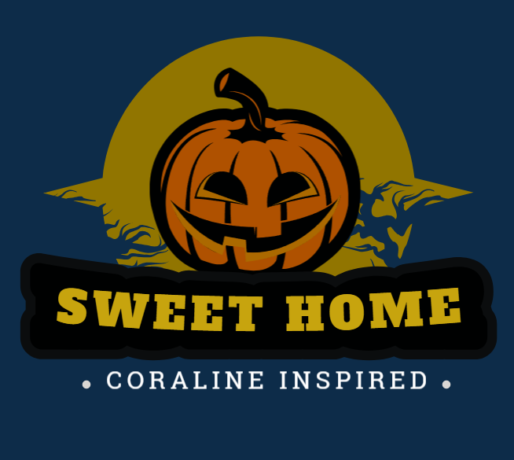
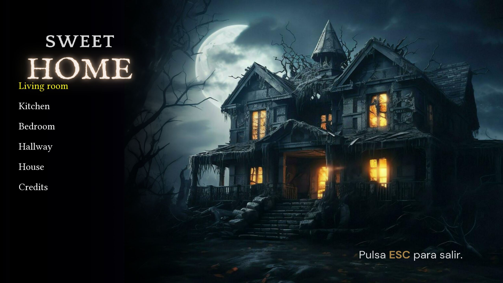
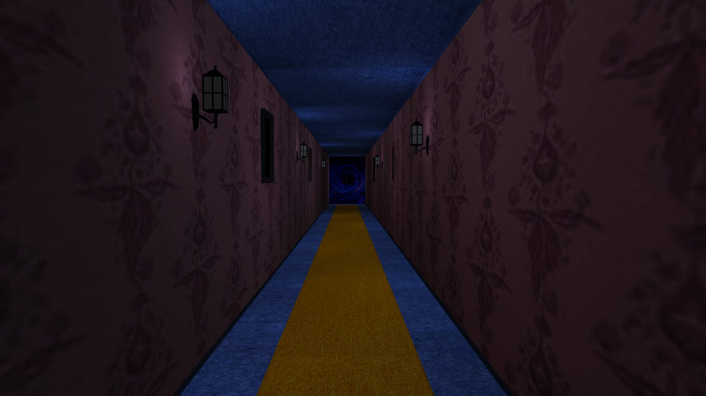
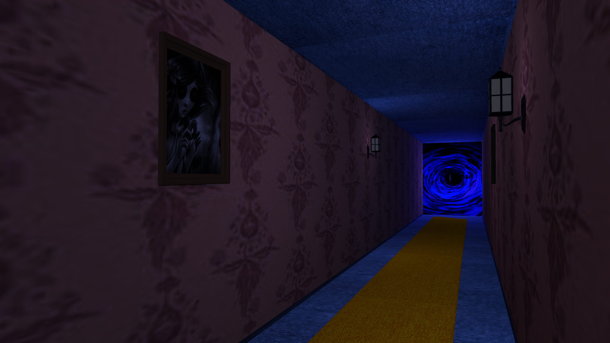
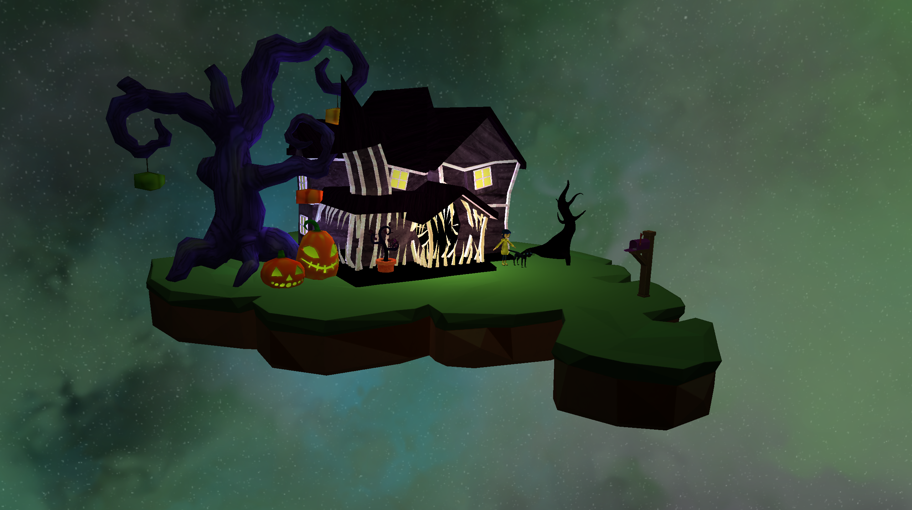

<!-- Improved compatibility of back to top link: See: https://github.com/othneildrew/Best-README-Template/pull/73 -->
<a id="readme-top"></a>


<!-- PROJECT SHIELDS -->

[![Contributors][contributors-shield]][contributors-url]
[![Forks][forks-shield]][forks-url]
[![Stargazers][stars-shield]][stars-url]

<!-- PROJECT LOGO -->
<br />
<div align="center">
  <a href="https://github.com/Leyan505/SweetHome">
    
  </a>

<h3 align="center">SweetHome</h3>

  <p align="center">
    Coraline’s house inspired 3D environment
    <br />
    <a href="https://github.com/Leyan505/SweetHome"><strong>Explore the repo »</strong></a>
    <br />
  </p>
</div>


<!-- TABLE OF CONTENTS -->
<details>
  <summary>Table of Contents</summary>
  <ol>
    <li>
      <a href="#about-the-project">About The Project</a>
      <ul>
        <li><a href="#built-with">Built With</a></li>
      </ul>
    </li>
    <li>
      <a href="#getting-started">Getting Started</a>
      <ul>
        <li><a href="#prerequisites">Prerequisites</a></li>
        <li><a href="#installation">Installation</a></li>
      </ul>
    </li>
    <li><a href="#usage">Usage</a></li>
    <li><a href="#license">License</a></li>
    <li><a href="#acknowledgments">Acknowledgments</a></li>
  </ol>
</details>


<!-- ABOUT THE PROJECT -->
## About The Project


SweetHome is a 3D environment heavily inspired by the movie coraline. It contains four rooms, with a view of the exterior of the house. Each room has it's own unique touch, it's unique soundtrack and easter eggs to provide an immersive experience. This project is made for the purpose of learning openGL and to let creativity take the driver's seat.



<p align="right">(<a href="#readme-top">back to top</a>)</p>


### Built With

* [![CMake][CMake]][CMake-url]
* [![OpenGL][OpenGL]][OpenGL-url]
* [![SFML][SFML]][SFML-url]

<p align="right">(<a href="#readme-top">back to top</a>)</p>


<!-- GETTING STARTED -->
## Getting Started

In order to run it, CMake has to be installed. Due to the nature of the project and the use of static and dynamic libraries imported with the project, there is no need for any other dependencies.

### Prerequisites

It is inferred that you already have a C++ compiler, MSVC compiler 2019 or newer is preferred.

#### Windows

* CMake
  ```sh
  winget install kitware.cmake
  ```
* Make
  ```sh
  winget install ezwinports.make
  ```
You also need to add ```C:\Program Files (x86)\GnuWin32\bin``` to the windows PATH environment variable. You can also use NINJA instead.

#### Linux (Fedora)

```
  sudo dnf install cmake
```


### Installation

1. Clone the repo
   ```sh
   git clone https://github.com/Leyan505/SweetHome.git
   ```
2. Configure CMake
   ```sh
   cmake CMakeLists.txt
   ```
3. Run the executable on the bin folder
   ```
   cd bin
   ./main.exe
   ```

<p align="right">(<a href="#readme-top">back to top</a>)</p>


<!-- USAGE EXAMPLES -->
## Usage

Run the program, there will be a menu screen, you can choose from 6 options and when you select one you can come back to the menu by pressing ESCAPE:

* Living room

* Kitchen
  
  

* Bedroom
  
* Hallway
  
  
  
  
* House
  
  

* Credits

<p align="right">(<a href="#readme-top">back to top</a>)</p>

<!-- ACKNOWLEDGMENTS -->
## Colaborators
* [Andres Guido](https://github.com/Leyan505)
* [Lia Cruz](https://github.com/caelruz4)
* [Eloisse Molina](https://github.com/Elomolina)
* [Jorge Lopez](https://github.com/1JorgeUni1)

<p align="right">(<a href="#readme-top">back to top</a>)</p>
 
<!-- LICENSE -->
## License

Distributed under the MIT License. See `LICENSE.txt` for more information.

<p align="right">(<a href="#readme-top">back to top</a>)</p>


<!-- ACKNOWLEDGMENTS -->
## Acknowledgments

* [LearnOpenGL](https://learnopengl.com/)
* [SFML WIKI](https://github.com/SFML/SFML/wiki)
* [Khronos Registry](https://registry.khronos.org/)

<p align="right">(<a href="#readme-top">back to top</a>)</p>


<!-- MARKDOWN LINKS & IMAGES -->
<!-- https://www.markdownguide.org/basic-syntax/#reference-style-links -->
[contributors-shield]: https://img.shields.io/github/contributors/Leyan505/SweetHome.svg?style=for-the-badge
[contributors-url]: https://github.com/Leyan505/SweetHome/graphs/contributors
[forks-shield]: https://img.shields.io/github/forks/Leyan505/SweetHome.svg?style=for-the-badge
[forks-url]: https://github.com/Leyan505/SweetHome/network/members
[stars-shield]: https://img.shields.io/github/stars/Leyan505/SweetHome.svg?style=for-the-badge
[stars-url]: https://github.com/Leyan505/SweetHome/stargazers

[CMake]: https://img.shields.io/badge/CMake-3.5-CCCCCD?logo=CMake
[CMake-url]: https://cmake.org/
[OpenGL]: https://img.shields.io/badge/-OpenGL-5586A4?style=flat&logo=opengl&logoColor=white
[OpenGL-url]: https://opengl.org/
[SFML]: https://img.shields.io/badge/-SFML-8CC445?style=flat&logo=sfml&logoColor=white
[SFML-url]: https://sfml-dev.org/

## Video Demo
https://youtu.be/YGKOGz-7ubo

